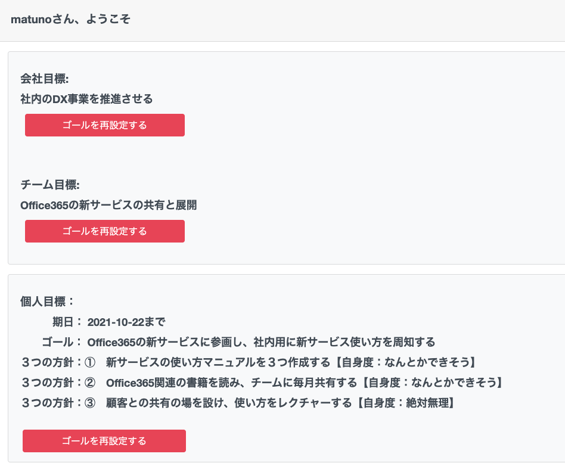
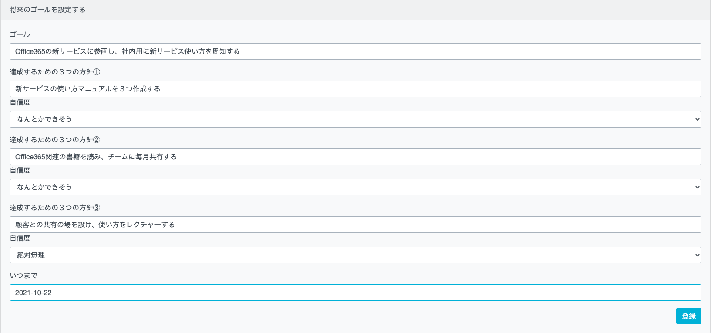
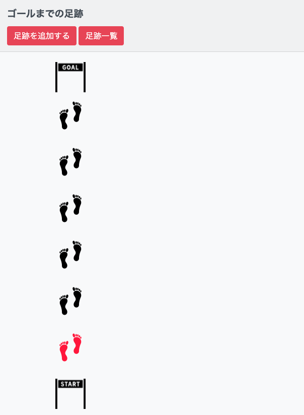
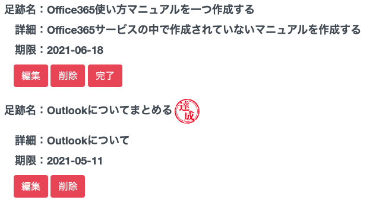
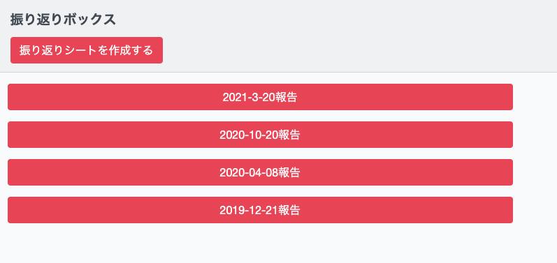
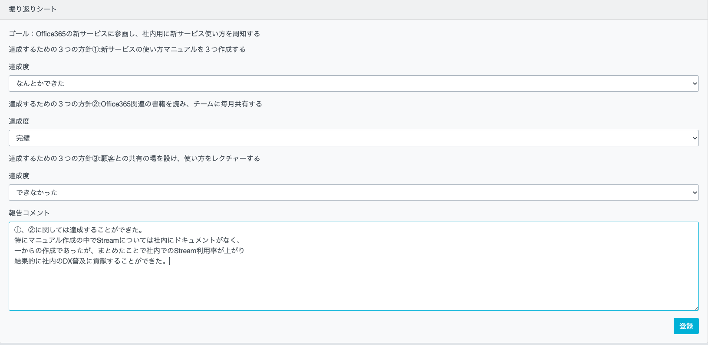

# FootPrints						
### 概要

目標を達成するための逆算型タスク管理アプリです。

  
FootPrintsでは以下３つの機能を提供し、目標達成の手助けをします。

    <dl>
      <dt>目標の可視化をします</dt>
      <dd>会社・チーム・個人の3つ目標を作成できます。個人目標は目標の他に期日や目標達成するために必要な3つの方針を決めることができ、目標達成の明確化を図ります。</dd>
      <dt>目標までの足跡タスクを付けられます</dt>
      <dd>足跡の追加で目標までの進捗を確認できます。足跡一覧でタスクを管理します。</dd>
      <dt>目標の振り返りをします</dt>
      <dd>目標の報告シートを作成できます。目標の中で決めた３つの方針に対して達成度を付け自己評価をします。</dd>
    </dl>

### 本番環境
http://foot-print.net/
  
ログイン情報(テストアカウント)

+ testuser02@test.com

+ testUser995

  
		

### 制作背景

仕事で自分の立てた目標に対して、達成するために何が必要なのかどこまで進んでいるのか不明瞭である課題を解消するために製作しました。

    また目標に対して定期的に評価をして、自分が過去どんな評価をしているか振り返りたいこともあり振り返り機能も実装しました。

					

### DEMO

ログイン後(もしくは会員登録後)目標を設定することができます

個人の目標ではゴール名の他、達成するための３つの方針(方針事に自身度を付ける)・期日を付けることができます

右上の「ゴールまでの足跡」リンクをクリック後、個人の目標に対して「足跡を追加する」でタスクを追加できます

「足跡一覧」にて作成したタスクを管理することができます

「振り返りシートを作成する」にて作成した目標に対しての評価をすることができます

振り返りシートでは目標に対しての達成度や、報告コメントを作成できます

### 工夫したポイント					

以下機能について工夫しました。
<dl>
  <dt>足跡タスク完了機能</dt>
  <dd>タスクとタスク完了のテーブルを分けて、完了したかどうかを判断させるのに工夫を凝らしました。複数のタスクの中からタスク完了テーブルと紐づくタスクを判断させるために、foreachでタスクを一つずつ出力した後foreachの中で完了テーブルがgetできるか判断する条件文を付けることで解消しました。</dd>
  <dt>報告機能(フロント部分)</dt>
  <dd>過去の振り返りシートをクリックすると、クリックした特定のモーダル画面を出すようにするのに工夫を凝らしました。モーダル画面はbootstrap4で実装しているため、仕様上一つしか出せないようになっています(どのボタンを押しても初めの報告内容しか出てこない)。そのためforeachで出した報告情報(id)をモーダルのidにすることでモーダルを複数出せるように解消しました。</dd>
</dl>

### 使用技術(開発環境)
<dl>
  <dt>フロント</dt>
  <dd>html css javascript jquery bootstrap(4.3.1)</dd>
  <dt>バックエンド</dt>
  <dd>php(7.4.16) Laravel(6.20.8)</dd>
  <dt>インフラ</dt>
  <dd>AWS(EC2/RDS(mysql)/Route53) Nginx phpfpm</dd>
</dl>

### 課題や今後実装したい機能

以下機能を実装したいです

+ SSH化
+ AWS(ECS/ECR)導入 			
+ 目標の残り日数機能
+ 個人の足跡タスク消化率機能
+ 足跡タスクの期限切れ表示機能

### DB設計
#### users テーブル
##### ユーザ情報
| Column   | Type   | Options                |
| -------- | ------ | ---------------------- |
| name     | string | null:false             |
| email    | string | null:false,unipue:true |
| password | string | null:false             |

#### users_Association
- has_one :ideal
- has_many :futures
- has_one :index_content
- has_many :dones
- has_many :report_contents
- has_one :company
- has_one :team

#### ideals テーブル
##### 個人目標情報
| Column      | Type       | Options    |
| ----------- | ---------- | ---------- |
| user_id     | integer    | null:false |
| title       | string     | null:false |
| limit       | date       | null:false |
| declaration | date       | null:false |
| user        | references |            |

#### ideals_Association
- belongs_to :user

#### futures テーブル
##### 足跡タスク情報
| Column      | Type       | Options    |
| ----------- | ---------- | ---------- |
| user_id     | integer    | null:false |
| title       | string     | null:false |
| detail      | string     | null:false |
| limit       | date       | null:false |
| user        | references |            |

#### futures_Association
- has_many :dones

#### index_contentsテーブル
##### 個人目標3つの方針情報
| Column   | Type       | Options    |
| -------- | ---------- | ---------- |
| user_id  | integer    | null:false |
| content1 | string     | null:false |
| content2 | string     | null:false |
| content3 | string     | null:false |
| user     | references |            |

#### index_contents_Association
- has_many :dones

#### index_statusesテーブル
##### 個人目標3つの方針自身度情報
| Column           | Type       | Options    |
| ---------------- | ---------- | ---------- |
| user_id          | integer    | null:false |
| index_content_id | integer    | null:false |
| status1          | string     | null:false |
| status2          | string     | null:false |
| status3          | string     | null:false |
| user             | references |            |
| index_content    | references |            |

#### index_statuses_Association
- belongs_to :index_content

#### donesテーブル
##### 足跡タスク完了情報
| Column    | Type       | Options    |
| --------- | ---------- | ---------- |
| user_id   | integer    | null:false |
| future_id | integer    | null:false |
| user      | references |            |
| future    | references |            |

#### dones_Association
- belongs_to :user
- belongs_to :future

#### report_contentsテーブル
##### 報告情報
| Column      | Type       | Options    |
| ----------- | ---------- | ---------- |
| user_id     | integer    | null:false |
| content1    | string     | null:false |
| content2    | string     | null:false |
| content3    | string     | null:false |
| comment     | string     | null:false |
| declaration | date       | null:false |
| user        | references |            |

#### dones_Association
- has_many :report_statuses

#### report_statusesテーブル
##### 報告達成度情報
| Column            | Type       | Options    |
| ----------------- | ---------- | ---------- |
| user_id           | integer    | null:false |
| report_content_id | integer    | null:false |
| status1           | string     | null:false |
| status2           | string     | null:false |
| status3           | string     | null:false |
| user              | references |            |
| report_content    | references |            |

#### index_statuses_Association
- belongs_to :report_content

#### copanies テーブル
##### 会社目標情報
| Column      | Type       | Options    |
| ----------- | ---------- | ---------- |
| user_id     | integer    | null:false |
| title       | string     | null:false |
| user        | references |            |

#### ideals_Association
- belongs_to :user

#### teams テーブル
##### チーム目標情報
| Column      | Type       | Options    |
| ----------- | ---------- | ---------- |
| user_id     | integer    | null:false |
| title       | string     | null:false |
| user        | references |            |

#### ideals_Association
- belongs_to :user
